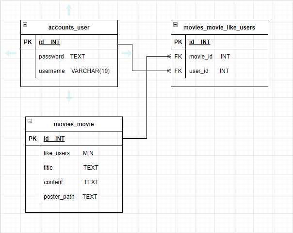
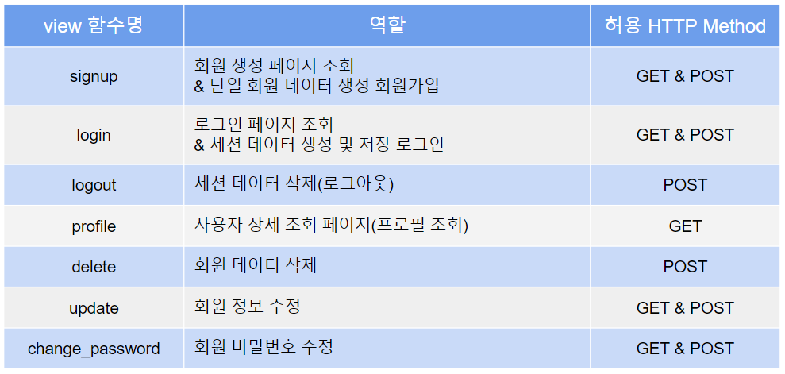
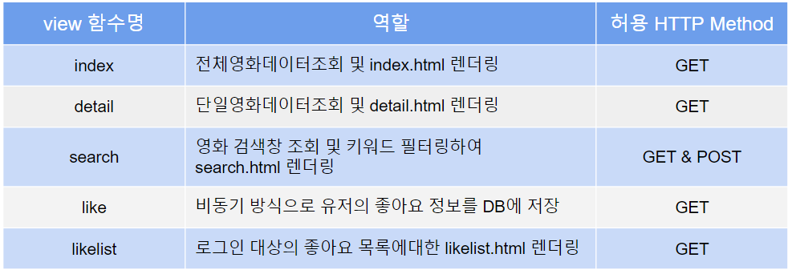

# Final-Project

# INDEX

- [협업 명단](#협업-명단)

- [개발 기간](#개발-기간)

- [개발 환경](#개발-환경)

- [목표](#목표)

- [요구 사항](#요구-사항)

- [사용 API](#사용-api)

- [ERD](#erd)

- [Fixture](#fixture)

- [MODEL](#model)

- [URL](#url)

- [View](#view)

- [세부 기능](#세부-기능)

# 협업 명단

-  8기 김정수(Back-end)

-  8기 한원종(Front-end)

# 개발 기간

-  2022년 11월 15일 - 2022년 11월 24일

# 개발 환경

-  vscode(1.69.2)

-  Django 3.2.13

# 목표

-  API를 통해 얻은 영화 데이터를 JSON 파일로 추출하여 페이지에 포스터 방식으로 출력한다.

-  계정당 좋아요한 목록을 DB에 저장하여 좋아요 리스트를 포스터 형식으로 따로 출력한다.

-  키워드 검색을 통해 영화제목을 검색한다.

# 요구 사항

-  모든 기능은 로그인 상태에서만  접근 & 사용가능하다.

-  API를 이용해 영화 데이터를 DB에 저장한다.

-  로그인한 User가 특정 영화의 좋아요 버튼을 누르면 DB에서 해당 정보를 기록한다.

-  검색은 키워드 입력으로 검색이 가능하도록한다.

# ERD



# Fixture

- ### TMDB API
  
  - (https://api.themoviedb.org/3/movie/top_rated)

- ### get_movie_data.py

- ```python
  import requests
  import json
  
  TMDB_API_KEY = 'MY_API_KEY'
  
  def get_movie_datas():
      total_data = []
  
      # 페이지당 20개, 조절 가능
      for i in range(1, 201):
          request_url = f"https://api.themoviedb.org/3/movie/popular?api_key={TMDB_API_KEY}&language=ko-KR&page={i}"
          movies = requests.get(request_url).json()
  
          for movie in movies['results']:
              if movie.get('release_date', '') and movie.get('poster_path', ''): # null 값을 필터링 하기 위한 코드
                  fields = {
                      'title': movie['title'],
                      'released_date': movie['release_date'],
                      'popularity': movie['popularity'],
                      'vote_avg': movie['vote_average'],
                      'overview': movie['overview'],
                      'poster_path': movie['poster_path'],
                  }
  
                  data = {
                      "pk": movie['id'],
                      "model": "movies.movie",
                      "fields": fields
                  }
  
                  total_data.append(data)
  
      with open("./movies/fixtures/movie.json", "w", encoding="utf-8") as w: # app 하위 fixtures 폴더에 json 파일 생성
          json.dump(total_data, w, indent="\t", ensure_ascii=False)
  
  get_movie_datas()
  ```

# MODEL

# URL

- ### accounts app
  
  -  /accounts/login/ : login 화면 출력
  
  -  /accounts/logout/ : 로그아웃 기능
  
  -  /accounts/signup/ : 회원 가입 화면
  
  -  /accounts/delete/ : 회원 탈퇴 기능(profile화면에서 가능)
  
  -  /accounts/update/ : 회원 정보 수정 화면
  
  -  /accounts/password/ : 비밀번호 수정 화면
  
  -  /accounts/profile/<<str:username>>/ :  유저 정보 화면

- ### movies app
  
  -  /movies/ :  전체 영화 포스터 조회(index)
  
  -  /movies/<<int:movie_pk>>/ : 영화 상세 정보 화면
  
  -  /movies/<<int:movie_pk>>/like/ : 영화 좋아요 기능
  
  -  /movies/likelist/<<str:username>>/ : 해당 유저의 좋아요 목록을 포스터로 조회
  
  -  /movies/search/ : 최초 접근 시 검색 버튼만 노출 -> 검색어 입력 시 검색창 하단에 입력한 키워드가 포함된 영화 제목 목록을 포스터 방식으로 조회

# View

- ### accounts
  
  

- ### movies
  
  

# 세부 기능

- ### 로그인 여부에 따라 페이지 표시 여부를 다르게 설정
  
  - #### 로그인 시
    
    -  상단 navbar 표시(Index, Likelist, search, Profile, Logout)
    
    -  Index : DB에 있는 영화정보 포스터로 나열
    
    -  Likelist : movie_like_users DB에서 user_id에 따른 movie_id 을 조회하여 영화 포스터 나열
    
    -  Search : 상단에 검색 창 표시, 특정 단어 입력 후 검색버튼을 누르면 rendering을 거쳐 검색창하단에 영화 목록 포스터로표시
    
    -  Profile : Login 되어 있는 User에 대한 좋아요 목록 표시
    
    -  Logout : User Logout
  
  - #### 미 로그인 시
    
    -  Navbar 미 노출
    
    -  화면 중앙에 Login form 출력(하단에 Login 버튼, Signup 버튼 출력)

# 후기

- 
