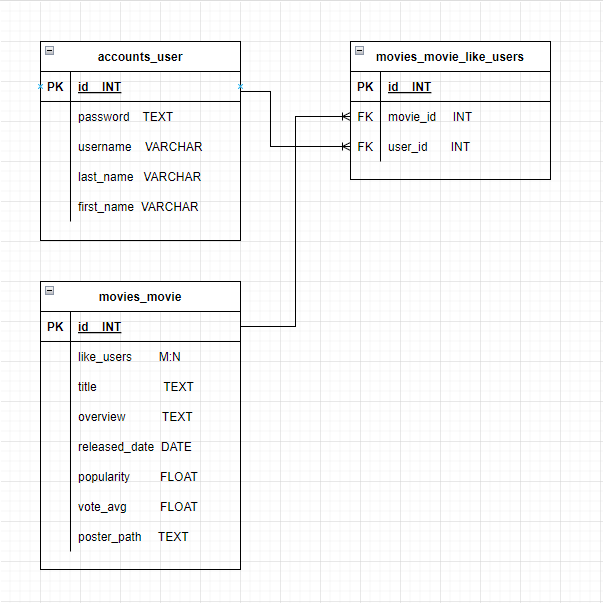
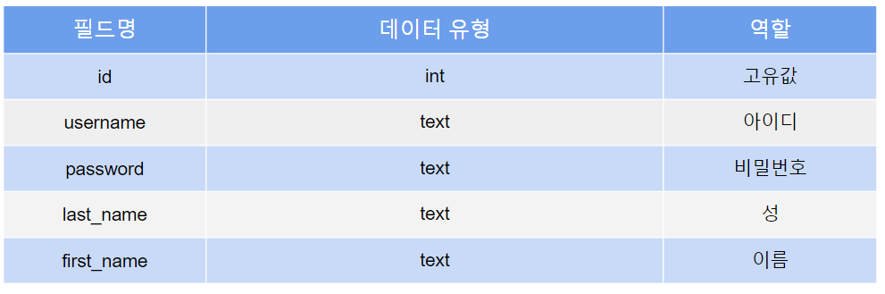
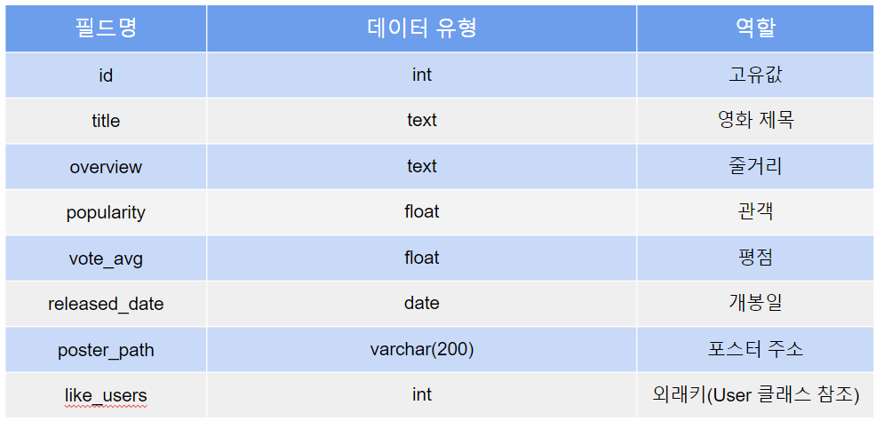
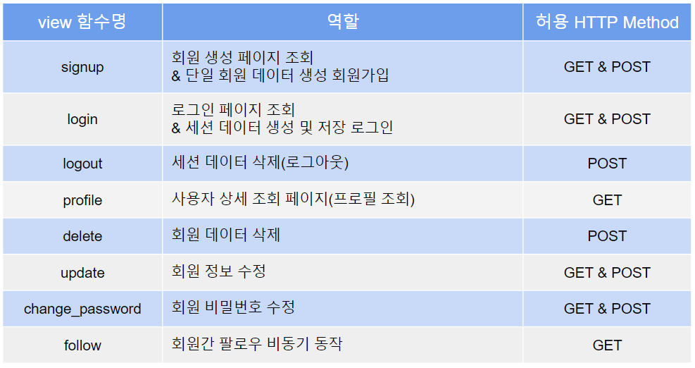

# Final-Project

# INDEX

- [협업 명단](#협업-명단)

- [개발 기간](#개발-기간)

- [개발 환경](#개발-환경)

- [목표](#목표)

- [요구 사항](#요구-사항)

- [사용 API](#사용-api)

- [ERD](#erd)

- [Fixture](#fixture)

- [MODEL](#model)

- [URL](#url)

- [View](#view)

- [세부 기능](#세부-기능)

- [후기](#후기)

# 협업 명단

- 8기 김정수(Back-end)
  
  - TMDB API date를 python을 통해 json 파일로 변환 -> db에 저장
  
  - "메인"페이지에 db 데이터 호출 기능
  
  - "좋아요"페이지에 로그인 되어있는 유저의 팔로잉 & 좋아요 누른 영화 목록 출력
  
  - 키워드 입력을 통해 다른 계정 검색 & 영화 제목검색 등 통합 검색 기능 구현

- 8기 한원종(Front-end)
  
  - 레이아웃 디자인 제작(bootstrap, css)
  
  - javascript를 이용한 좋아요 비동기 동작 구현
  
  - javascript를 이용한 팔로우 비동기 동작 구현
  
  - User form(signup, login, update) 제작 

# 개발 기간

- 2022년 11월 15일 - 2022년 11월 24일

# 개발 환경

- vscode(1.69.2)

- Django 3.2.13

# 목표

- API를 통해 얻은 영화 데이터를 JSON 파일로 추출하여 페이지에 포스터 방식으로 출력한다.

- 계정당 좋아요한 목록을 DB에 저장하여 좋아요 리스트를 포스터 형식으로 따로 출력한다.

- 키워드 검색을 통해 영화제목을 검색한다.

# 요구 사항

- 모든 기능은 로그인 상태에서만  접근 & 사용가능하다.

- API를 이용해 영화 데이터를 DB에 저장한다.

- 로그인한 User가 특정 영화의 좋아요 버튼을 누르면 DB에서 해당 정보를 기록한다.

- 검색은 키워드 입력으로 검색이 가능하도록한다.

# ERD



# Fixture

- ### TMDB API
  
  - (https://api.themoviedb.org/3/movie/top_rated)

- ### get_movie_data.py

- ```python
  import requests
  import json
  
  TMDB_API_KEY = 'MY_API_KEY'
  
  def get_movie_datas():
      total_data = []
  
      # 페이지당 20개, 조절 가능
      for i in range(1, 201):
          request_url = f"https://api.themoviedb.org/3/movie/popular?api_key={TMDB_API_KEY}&language=ko-KR&page={i}"
          movies = requests.get(request_url).json()
  
          for movie in movies['results']:
              if movie.get('release_date', '') and movie.get('poster_path', ''): # null 값을 필터링 하기 위한 코드
                  fields = {
                      'title': movie['title'],
                      'released_date': movie['release_date'],
                      'popularity': movie['popularity'],
                      'vote_avg': movie['vote_average'],
                      'overview': movie['overview'],
                      'poster_path': movie['poster_path'],
                  }
  
                  data = {
                      "pk": movie['id'],
                      "model": "movies.movie",
                      "fields": fields
                  }
  
                  total_data.append(data)
  
      with open("./movies/fixtures/movie.json", "w", encoding="utf-8") as w: # app 하위 fixtures 폴더에 json 파일 생성
          json.dump(total_data, w, indent="\t", ensure_ascii=False)
  
  get_movie_datas()
  ```

# MODEL

- ### accounts
  
  

- ### movies
  
  

# URL

- ### accounts app
  
  - /accounts/login/ : login 화면 출력
  
  - /accounts/logout/ : 로그아웃 기능
  
  - /accounts/signup/ : 회원 가입 화면
  
  - /accounts/delete/ : 회원 탈퇴 기능(profile화면에서 가능)
  
  - /accounts/update/ : 회원 정보 수정 화면
  
  - /accounts/password/ : 비밀번호 수정 화면
  
  - /accounts/profile/<<str:username>>/ :  유저 정보 화면
  
  - /<<int:user_pk>>/follow/ : 유저 팔로우 기능

- ### movies app
  
  - /movies/ :  전체 영화 포스터 조회(index)
  
  - /movies/<<int:movie_pk>>/ : 영화 상세 정보 화면
  
  - /movies/<<int:movie_pk>>/like/ : 영화 좋아요 기능
  
  - /movies/likelist/<<str:username>>/ : 해당 유저의 좋아요 목록을 포스터로 조회
  
  - /movies/search/ : 최초 접근 시 검색 버튼만 노출 -> 검색어 입력 시 검색창 하단에 입력한 키워드가 포함된 영화 제목 목록을 포스터 방식으로 조회

# View

- ### accounts
  
  

- ### movies
  
  

# 세부 기능

- ### 로그인 여부에 따라 페이지 표시 여부를 다르게 설정
  
  - #### 로그인 시
    
    - 상단 navbar 표시(Index, Likelist, search, Profile, Logout)
    
    - Index : DB에 있는 영화정보 포스터로 나열
    
    - Likelist : movie_like_users DB에서 user_id에 따른 movie_id 을 조회하여 영화 포스터 나열 및 자신이 팔로우한 유저 목록 조회
    
    - Search : 상단에 검색 창 표시, 특정 단어 입력 후 검색버튼을 누르면 rendering을 거쳐 검색창하단에 영화 목록 및 유저 아이디 검색
    
    - Profile : Login 되어 있는 User에 대한 팔로워, 팔로잉 수 & 좋아요한 영화 목록 표시, 별도의 회원탈퇴 버튼을 통해 회원탈퇴 기능 구현
    
    - Logout : 로그인 되어 있는 유저 로그아웃
  
  - #### 미 로그인 시
    
    - Navbar 미 노출
    
    - 화면 중앙에 Login form 출력(하단에 Login 버튼, Signup 버튼 출력)

# 후기

- ### 김정수
  - 프로젝트를 통해 API 데이터를 json형태로 불러오는 방식을 공부할 수 있었습니다.
  - 원래 구현하고자 했던 기능 중 데이터 전달 방식이 어려워 실제로 구현하지 못한 기능들이 있어서 아쉬웠습니다.
  - 한 학기 동안 배운 기술스택을 최대한 활용하고자 했습니다.(python, django, javascript, database 등)
  - 전반적으로 back-end 분야를 도맡았으며 다소 수정이 필요한 부분에서만 bootstrap, css 등을 활용했습니다.
  - 협업 과정을 통해 git을 다루는 방법을 익힐 수 있게 되었으며 branch를 통해 분업을 진행 후 merge 과정에서 conflict를 해결하는 시행착오를 거치면서 git branch system을 명확하게 이해할 수 있게 되었습니다.
  - 참신한 기능을 구현하진 못했지만 배운 내용을 토대로 최대한 프로젝트를 완성도있게 마무리한 점은 만족스러웠습니다.

- ### 한원종
  - 한 학기 동안 배웠던 내용을 정리하고, 이를 바탕으로 실제 프로젝트로 응용했다는 점에서 매우 깊은 의의가 남는 프로젝트였습니다.
  - 새로운 기능 또는 참신한 UI & UX를 구현하지는 않았지만, 기한 내에 계획한 프로젝트를 완성했다는 점이 만족스러웠습니다.
  - 약 1~2주간의 협업을 통해서 현업에서 협업이 어떤 방식으로 이루어지는지 알 수 있었습니다. 그리고 협업에서 추구해야 하는 가장 중요한 가치는 성실함과 배려라는 것을 알 수 있었습니다.
  - 프로젝트를 진행하며 주로 Front-end를 다루었는데, 학기 초 이후로 잘 신경쓰지 못했던 부분을 다시 공부할 수 있었던 점에서 만족스러웠습니다.
  - 기획 단계에서 크롤링 기능을 구현하려 계획했지만, 짧은 일정으로 인하여 구현할 수 없었던 점은 아쉬움으로 남습니다. 추후에 기회가 되면 추가할 계획입니다.
  - 저와 같이 프로젝트를 진행하며 옆에서 많이 이끌어 주고 도와 준 김정수 교육생에게 감사의 말을 전합니다.
  - 한 학기 동안 함께 고생한 교수님과 프로님 등 SSAFY 관계자 여러분, 교육생들 모두에게 격려의 인사를 전합니다.